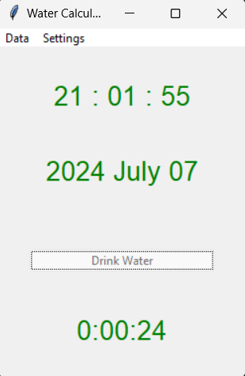
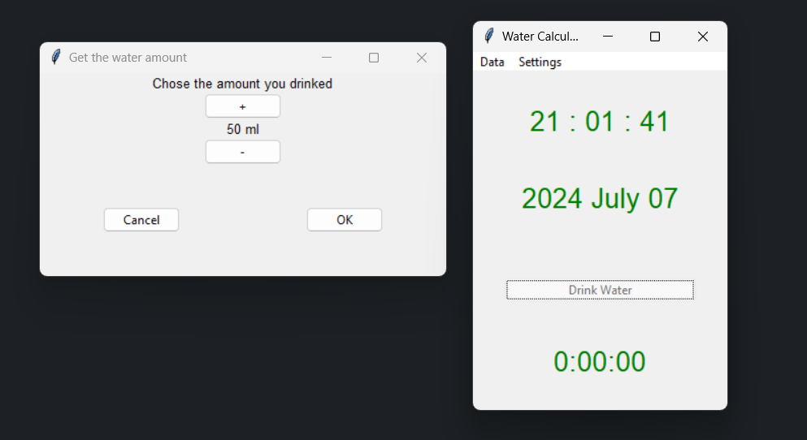
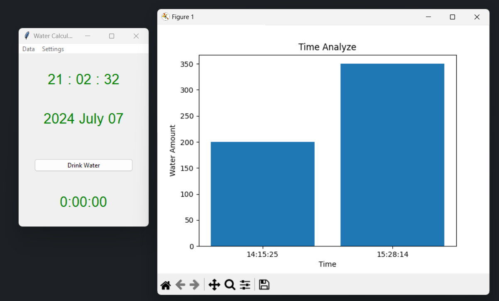

# Water Calculation App

## Introduction
The Water Calculation App helps users track their daily water intake. Users can input the amount of water they drink, and the app will log the data, display instructions, and send notifications as reminders.

## Features
- Record water intake with three predefined amounts.
- Display instructions and set a countdown for the next input.
- Notify the user every 2 minutes if no input is provided.
- Handle missed inputs with a secondary countdown.
- Save the time of app closure and resume tracking on the next startup.
- Store data in a local database.

## Installation
To install and run the Water Calculation App, follow these steps:

1. Clone the repository:
    ```sh
    git clone https://github.com/Akthar99/Water-Calculator.git
    ```

2. Navigate to the project directory:
    ```sh
    cd water-calculation-app
    ```

3. Install the required dependencies:
    ```sh
    pip install -r requirements.txt
    ```

4. Run the application:
    ```sh
    python app.py
    ```

## Usage
1. Open the application.
2. Use the three child buttons to input the amount of water you drink.
3. Follow the instructions displayed by the app and wait for the countdown.
4. Respond to notifications and input missed data when prompted.
5. The app will save your input data to the local database.

## App Structure
- **Input Section:** Three buttons to input predefined water amounts.
- **Instruction Section:** Displays instructions and countdown timers.
- **Output Section:** Shows the time, date, and amount of water inputted, and saves the data to the database.

## Output Section
Every time the user adds an input, the output section shows the time, date, and amount of water added. The data is also saved to the local database.

## Background Operation
The app runs in the background and sends notifications every 2 minutes to remind the user to input their water intake.

## Handling App Closure
When the user accidentally or intentionally closes the app, the exit time is saved in the database. On the next startup, the app checks the time gap and adjusts the tracking accordingly.

## Database Structure
The database stores the following information:
- `time`: The time of the water intake.
- `date`: The date of the water intake.
- `wait_time`: The time the user waited before inputting data.
- `water`: The amount of water intake.

## Screenshots
<div style="text-align: center;">

</div>


 

## Videos
[](videos/demo_video.mp4)

## References
- [Water icons created by Freepik - Flaticon](https://www.flaticon.com/free-icons/water)